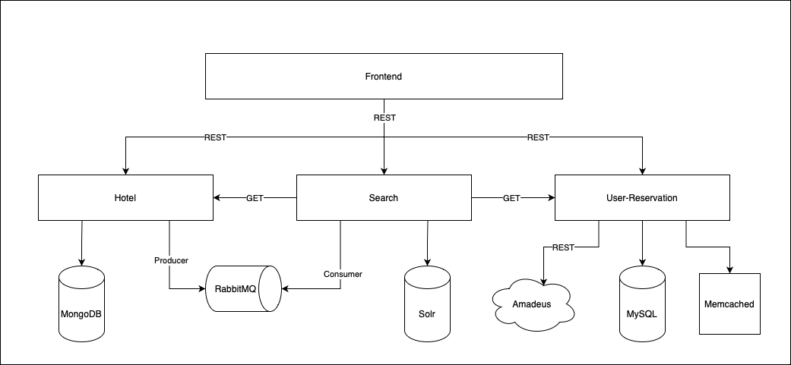

# Miranda Hotels

## About

Miranda Hotels is a website created from scratch designed to handle hotel reservations. The site contains a home page
that shows all the hotels registered on the site. This page shows each hotel's name, address, price per night and an
image. The user can then click on the hotel's name to view more information about it, like its description, more photos
and (if logged in as a Customer user) a calendar to book it. Each user also can access his own profile, where he can
manage the reservations he made, view his information or log out of the site. All the user's data is stored securely, as
the password is hashed inside the database and the login information is stored on the browser's localstorage using JWT.
It's important to mention that the site does not support any sort of payment methods.

### Users

The site stores the following data for each user:

- Name.
- Last name.
- DNI.
- Email (unique for each user).
- Password.
- Role

There are two types of users:
- Customer: is able to book hotels, view hotels available by city and cancel his reservations.
- Admin: is able to create, delete and update hotels, see all bookings filtered by user or by hotel and check the
  status of the Docker containers on which the site runs. This type of user can also create and delete new instances of
  the scalable microservices, which will be detailed later.

By default, there's only 1 Admin user, and each person that signs up on the site is created as a Customer user. There is
no direct way to create an Admin user, to do so the person has to register himself on the site and then change his user
role to "Admin" on the database through the following SQL sentence:

```mysql
UPDATE users SET role = 'Admin' WHERE email = 'useremail@email.com'
```

### Hotels

The site stores the following information for each hotel:

- Name.
- Amount of rooms.
- Street name.
- Street number.
- City.
- Description.
- Rate (per night).
- Amenities.
- Images.

It's important to mention some limitations regarding hotels, as each hotel can only have one rate and only one type of
room.

### Reservations

The site stores the following information for each reservation:

- Start date (check-in).
- End date (check-out).
- User Id.
- Hotel Id.
- Amount ($).

It's assumed all hotels have the same check-in time (15:00) and the same check-out time (11:00). Before making each
reservation, the site checks if the hotel is available in that period of time, considering other bookings and the amount
of rooms the hotel has. Also, the site checks the hotel availability through Amadeus, which is a third-party site that's
useful to centralize this information, in case there are other sites that offer the same hotel.

## Implementation

The entire project is built using the microservices architecture, using Docker containers to host them and a single
network where all the containers run using Docker Compose. All backend services have a load balancer implemented and
auto-scaling to be able to grow horizontally if traffic increases.

To start the project, inside the root folder, run the following terminal command:
```
docker-compose up --build
```

### Technologies

- Backend: Go (MVC framework).
- Databases: MySQL, MongoDB.
- Frontend: React.
- Search Engine: Solr.
- Queue: RabbitMQ.
- Load Balancer: nginx.
- Cache: memcached.

### Microservices

- Frontend.


- Hotel: connected to a MongoDB database that contains all hotel related information and supports its CRUD operations.
  This service is also a queue producer, that publishes a message each time a hotel is created, updated or deleted.


- Search: connected to the solr search engine that enables better performance when retrieving hotel information. It is
  synced to the hotel service information through the queue, as it consumes the messages stored in it and updates the
  search engine accordingly.


- User-Reservation: connected to a MySQL database that contains all user and booking related information. It's
  connected to the search service through http requests to be able to retrieve all hotels available in a certain city and
  time period. This information is stored in a cache during 10 seconds to improve its availability.

### Architecture

